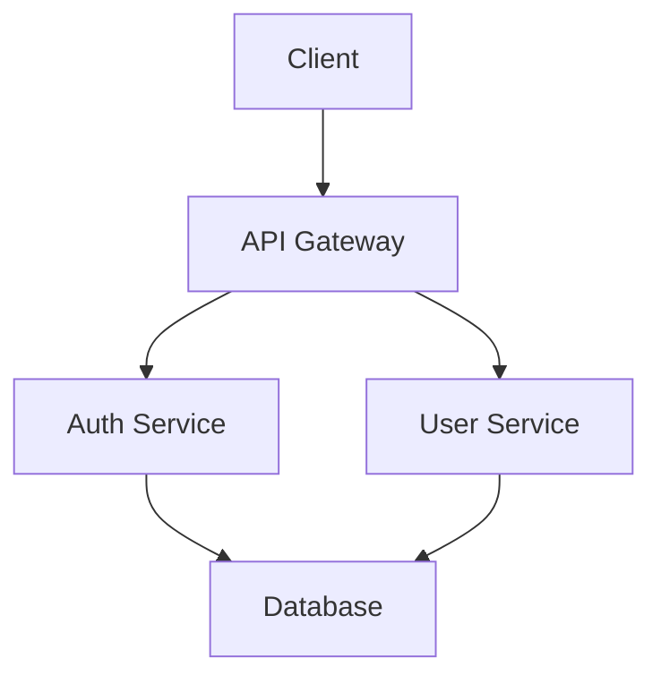

# Architecture Documentation: ADRs, Diagrams, System Documentation

## Overview

Architecture Documentation captures design decisions, system structure, and technical specifications. This guide covers Architecture Decision Records (ADRs), diagrams, and system documentation practices.

## Architecture Documentation Types

```
┌─────────────────────────────────────────────────────────┐
│         Architecture Documentation                      │
└─────────────────────────────────────────────────────────┘

ADRs (Architecture Decision Records)
    │ (Design decisions)
    ▼
Diagrams
    │ (Visual representations)
    ▼
System Documentation
    │ (Technical specifications)
    └─ Complete system overview
```

## 1. Architecture Decision Records (ADRs)

### What are ADRs?

ADRs document important architectural decisions, including context, decision, and consequences.

### ADR Structure

```markdown
# ADR-001: Use Microservices Architecture

## Status
Accepted

## Context
We need to scale our application to handle increasing load.
The monolithic architecture is becoming difficult to maintain.

## Decision
We will adopt a microservices architecture, splitting the
monolith into smaller, independent services.

## Consequences

### Positive
- Independent scaling of services
- Technology diversity
- Team autonomy
- Easier deployment

### Negative
- Increased complexity
- Network latency
- Distributed system challenges
- More infrastructure needed

## Alternatives Considered
1. Modular monolith - Rejected (still single deployment)
2. Service-oriented architecture - Rejected (too complex)
3. Microservices - Accepted

## References
- Microservices Patterns (book)
- Team discussion: 2024-01-15
```

### ADR Template

```markdown
# ADR-[number]: [Title]

## Status
[Proposed | Accepted | Rejected | Deprecated | Superseded]

## Context
[Describe the issue or situation that requires a decision]

## Decision
[State the decision that was made]

## Consequences

### Positive
- [Benefit 1]
- [Benefit 2]

### Negative
- [Drawback 1]
- [Drawback 2]

## Alternatives Considered
1. [Alternative 1] - [Why rejected]
2. [Alternative 2] - [Why rejected]
3. [Chosen alternative] - [Why accepted]

## References
- [Link to discussion]
- [Link to documentation]
```

### ADR Examples

#### ADR-001: Database Choice
```markdown
# ADR-001: Use PostgreSQL as Primary Database

## Status
Accepted

## Context
We need to choose a database for our application that can
handle relational data, ACID transactions, and scale horizontally.

## Decision
We will use PostgreSQL as our primary database.

## Consequences

### Positive
- ACID compliance
- Strong consistency
- Rich feature set
- Active community
- Horizontal scaling with read replicas

### Negative
- Vertical scaling limitations
- Complex setup for high availability
- Learning curve for team

## Alternatives Considered
1. MySQL - Rejected (less features)
2. MongoDB - Rejected (no ACID guarantees)
3. PostgreSQL - Accepted (best fit)

## References
- Database comparison: docs/database-comparison.md
- Team discussion: 2024-01-10
```

#### ADR-002: API Gateway Pattern
```markdown
# ADR-002: Implement API Gateway

## Status
Accepted

## Context
With multiple microservices, we need a single entry point
for clients and centralized cross-cutting concerns.

## Decision
We will implement an API Gateway using Spring Cloud Gateway.

## Consequences

### Positive
- Single entry point
- Centralized authentication
- Request routing
- Load balancing
- Rate limiting

### Negative
- Single point of failure
- Additional latency
- Complexity

## Alternatives Considered
1. Direct service access - Rejected (no centralization)
2. Service mesh - Rejected (too complex for current needs)
3. API Gateway - Accepted

## References
- Spring Cloud Gateway docs
- Team discussion: 2024-01-20
```

### ADR Best Practices

#### 1. Number Sequentially
```
docs/adr/
├─ 0001-record-architecture-decisions.md
├─ 0002-use-microservices.md
├─ 0003-api-gateway-pattern.md
└─ 0004-postgresql-database.md
```

#### 2. Keep Focused
- One decision per ADR
- Clear and concise
- Specific context

#### 3. Update Status
- Proposed → Accepted/Rejected
- Deprecated when superseded
- Link to superseding ADR

#### 4. Include Context
- Why decision was needed
- What problem it solves
- Constraints considered

## 2. Architecture Diagrams

### Diagram Types

#### 1. System Architecture Diagram
```
┌─────────────────────────────────────────────────────────┐
│         System Architecture                            │
└─────────────────────────────────────────────────────────┘

                    [Users]
                       │
                       ▼
              ┌────────────────┐
              │  API Gateway   │
              └────────┬───────┘
                       │
        ┌──────────────┼──────────────┐
        │              │              │
        ▼              ▼              ▼
   [Auth Service] [User Service] [Order Service]
        │              │              │
        └──────────────┼──────────────┘
                       │
                       ▼
              ┌────────────────┐
              │   Database     │
              └────────────────┘
```

#### 2. Component Diagram
```
┌─────────────────────────────────────────────────────────┐
│         Component Diagram                              │
└─────────────────────────────────────────────────────────┘

[User Service]
    │
    ├─► [User Controller]
    │       │
    │       ├─► [User Service Layer]
    │       │       │
    │       │       ├─► [User Repository]
    │       │       └─► [Email Service]
    │       │
    │       └─► [Validation]
    │
    └─► [Database]
```

#### 3. Sequence Diagram
```
┌─────────────────────────────────────────────────────────┐
│         Sequence Diagram                                │
└─────────────────────────────────────────────────────────┘

Client    API Gateway    Auth Service    User Service
  │            │              │                │
  │──login()──>│              │                │
  │            │──validate()─>│                │
  │            │<--token------│                │
  │            │              │                │
  │            │──getUser()───────────────────>│
  │            │              │                │
  │            │<--user------------------------│
  │<--response--│              │                │
```

#### 4. Deployment Diagram
```
┌─────────────────────────────────────────────────────────┐
│         Deployment Diagram                              │
└─────────────────────────────────────────────────────────┘

[Load Balancer]
       │
   ┌───┴───┐
   │       │
[Server 1] [Server 2]
   │       │
   └───┬───┘
       │
[Database Cluster]
```

### Diagram Tools

#### 1. PlantUML
```plantuml
@startuml
Client -> API Gateway: Request
API Gateway -> Auth Service: Validate
Auth Service --> API Gateway: Token
API Gateway -> User Service: Get User
User Service --> API Gateway: User Data
API Gateway --> Client: Response
@enduml
```

#### 2. Mermaid


#### 3. Draw.io / diagrams.net
- Visual diagram editor
- Multiple diagram types
- Export to various formats

#### 4. C4 Model
```
┌─────────────────────────────────────────────────────────┐
│         C4 Model Levels                                │
└─────────────────────────────────────────────────────────┘

Level 1: System Context
├─ System and external actors

Level 2: Container
├─ Applications and data stores

Level 3: Component
├─ Components within containers

Level 4: Code
└─ Classes and interfaces
```

## 3. System Documentation

### System Documentation Structure

```markdown
# System Architecture Documentation

## Overview
[System purpose and high-level description]

## Architecture
[Architecture overview and patterns]

## Components
[Detailed component descriptions]

## Data Flow
[How data flows through the system]

## Technology Stack
[Technologies used]

## Deployment
[Deployment architecture]

## Security
[Security considerations]

## Scalability
[Scaling strategies]

## Monitoring
[Monitoring and observability]
```

### System Documentation Sections

#### 1. Overview
```markdown
## Overview

The User Management System is a microservices-based application
for managing user accounts, authentication, and authorization.

### Key Features
- User registration and authentication
- Role-based access control
- User profile management
- Password reset functionality
```

#### 2. Architecture
```markdown
## Architecture

### Architecture Pattern
Microservices architecture with API Gateway pattern.

### Services
- **Auth Service**: Handles authentication and authorization
- **User Service**: Manages user data and profiles
- **Notification Service**: Sends emails and notifications

### Communication
- Synchronous: REST APIs
- Asynchronous: Message queues (RabbitMQ)
```

#### 3. Components
```markdown
## Components

### Auth Service
- **Purpose**: Authentication and authorization
- **Technology**: Spring Boot, JWT
- **Database**: PostgreSQL
- **Endpoints**: /auth/login, /auth/validate

### User Service
- **Purpose**: User data management
- **Technology**: Spring Boot, JPA
- **Database**: PostgreSQL
- **Endpoints**: /users, /users/{id}
```

#### 4. Data Flow
```markdown
## Data Flow

### User Registration Flow
1. Client sends registration request to API Gateway
2. API Gateway routes to User Service
3. User Service validates data and creates user
4. User Service publishes event to message queue
5. Notification Service consumes event and sends email
```

#### 5. Technology Stack
```markdown
## Technology Stack

### Backend
- Java 17
- Spring Boot 3.0
- Spring Cloud Gateway
- PostgreSQL 14

### Infrastructure
- Docker
- Kubernetes
- RabbitMQ
- Redis

### Monitoring
- Prometheus
- Grafana
- ELK Stack
```

## 4. Documentation Best Practices

### 1. Keep Updated
- Update with changes
- Version documentation
- Review regularly

### 2. Use Standards
- Follow ADR format
- Use standard diagram types
- Consistent structure

### 3. Make Accessible
- Centralized location
- Easy to find
- Searchable

### 4. Include Examples
- Code examples
- Configuration examples
- Usage examples

### 5. Visual Aids
- Diagrams
- Flowcharts
- Architecture diagrams

## 5. Documentation Tools

### ADR Tools
- **adr-tools**: Command-line ADR management
- **ADR Viewer**: Web-based ADR viewer
- **Markdown files**: Simple text-based

### Diagram Tools
- **PlantUML**: Text-based diagrams
- **Mermaid**: Markdown diagrams
- **Draw.io**: Visual editor
- **Lucidchart**: Cloud-based

### Documentation Platforms
- **Confluence**: Team documentation
- **GitBook**: Documentation sites
- **MkDocs**: Markdown documentation
- **Docusaurus**: Documentation websites

## Summary

Architecture Documentation:
- **ADRs**: Document design decisions
- **Diagrams**: Visual system representations
- **System Documentation**: Complete technical specifications

**Key Components:**
- Architecture Decision Records (ADRs)
- System architecture diagrams
- Component diagrams
- Sequence diagrams
- System documentation

**Best Practices:**
- Keep documentation updated
- Use standard formats
- Include visual aids
- Make accessible
- Review regularly

**Remember**: Good architecture documentation helps teams understand and maintain systems effectively!
